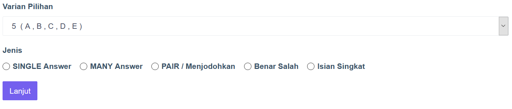

# Input soal secara manual.

Guru membuat/memasukkan soal langsung dalam sistem PTO. Untuk melakukannya, guru harus login menggunnakan akun khusus guru.

## Model soal AKM.

 Sebelum memulai proses input soal, sebaiknya pelajari dulu tentang beberapa model soal AKM, lihat [penjelasan model soal AKM](../assesment-type.md).

### Login menggunakan akun guru.

Untuk login atau masuk menggunakan guru, user hanya perlu mengakses halaman login https://nama-domain.com/login. Jika sudah login bisa melanjutkan ke proses [Input soal](#input-soal-secara-manual).

!!! Note

    Akun untuk guru dibuatkan oleh **Admin**. Lihat [Initial setup](../setup/initial-setup) untuk informasi secara rinci.

## Input soal secara manual

1. Login menggunakan akun guru lihat [Login guru](#login-menggunakan-akun-guru).
2. Klik **Soal**, kemudian pada submenu klik **Tambah soal**.
3. Isikan detail yang diminta.
    - **Tingkat**: soal dibuat untuk kelas berapa.
    - **Mapel**: soal merupakan mata pelajaran apa.
    - **Tipe**: terdapat 2 macam yaitu **Pilihan Ganda** dan **Essay**.
4. Klik **Lanjut** jika sudah terisi semua.
5. Jika belum membuat **Kategori**, maka akan terisi _Kosong_.
    - Ketik pertanyaan pada kolom _Soal_. Kolom soal adalah WYSIWYG editor.
    - Dapat menyertakan gambar, pengaturan tebal/miring/garis bawah dan pengaturan lainnya.
    - **Varian Pilihan** adalah jumlah pilihan jawaban (minimal 2, maksimal 5)
    - **Jenis**, silakan pilih jenis soal yang akan dibuat.

    

6. Untuk jenis soal **Single Answer**:
    - Isikan pilihan jawaban di masing-masing kolom yang disediakan
    - Dapat menyertakan gambar
    - Pada dropdown **Kunci**, pilih 1 jawaban yang benar.
    - Klik **Submit**.
7. Untuk jenis soal **Many Answer**:
    - Klik/centang checbox **Kunci** untuk pilihan yang merupakan kunci jawaban.
    - Harus ada **minimal 1 kunci jawaban**.