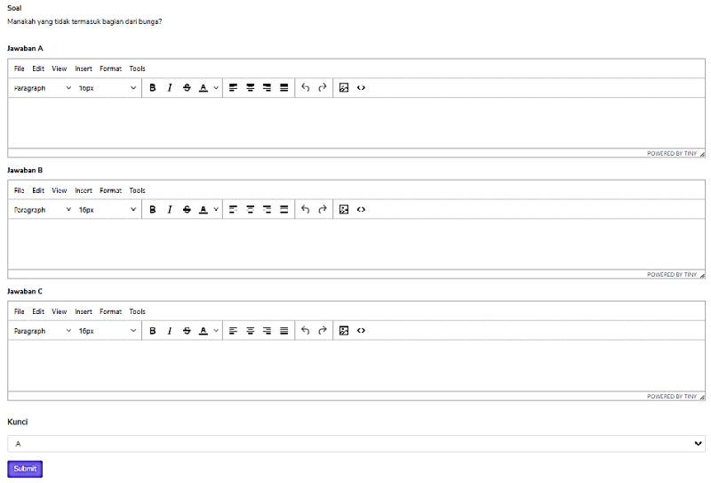
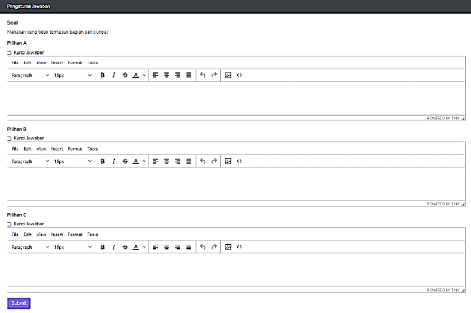
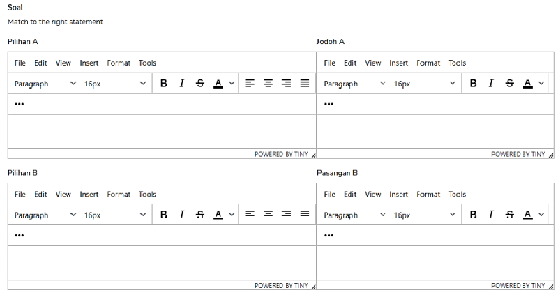
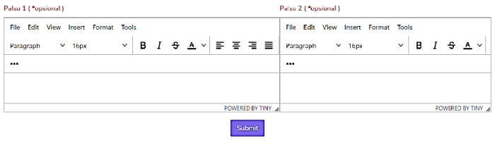
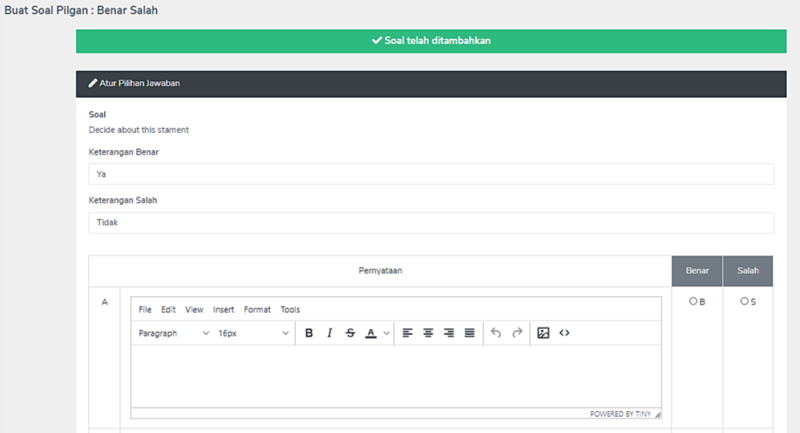
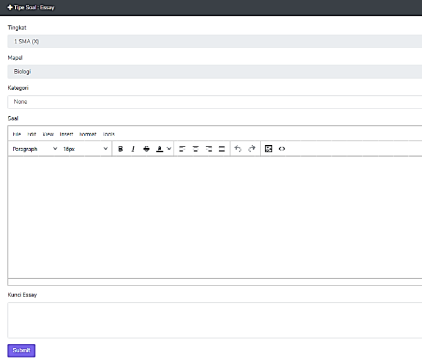

# Input soal secara manual.

Guru membuat/memasukkan soal langsung dalam sistem PTO. Untuk melakukannya, guru harus login menggunnakan akun khusus guru.

## Model soal AKM.

 Sebelum memulai proses input soal, sebaiknya pelajari dulu tentang beberapa model soal AKM, lihat [penjelasan model soal AKM](definisi.md).

### Login menggunakan akun guru.

Untuk login atau masuk menggunakan guru, user hanya perlu mengakses halaman login https://nama-domain.com/login. Jika sudah login bisa melanjutkan ke proses [Input soal](#input-soal-secara-manual).

!!! Note

    Akun untuk guru dibuatkan oleh **Admin**. Lihat [Initial setup](../setup/initial-setup) untuk informasi secara rinci.

## Input soal secara manual

1. Login menggunakan akun guru lihat [Login guru](#login-menggunakan-akun-guru).
2. Klik **Soal**, kemudian pada submenu klik **Tambah soal**.
3. Isikan detail yang diminta.
    - **Tingkat**: soal dibuat untuk kelas berapa.
    - **Mapel**: soal merupakan mata pelajaran apa.
    - **Tipe**: terdapat 2 macam yaitu **Pilihan Ganda** dan **Essay**.
4. Klik **Lanjut** jika sudah terisi semua.
5. Jika belum membuat **Kategori**, maka akan terisi _Kosong_.
    - Ketik pertanyaan pada kolom _Soal_. Kolom soal adalah WYSIWYG editor.
    - Dapat menyertakan gambar, pengaturan tebal/miring/garis bawah dan pengaturan lainnya.
    - **Varian Pilihan** adalah jumlah pilihan jawaban (minimal 2, maksimal 5)
    - **Jenis**, silakan pilih jenis soal yang akan dibuat.

    

## **Single Answer**
    

- Isikan pilihan jawaban di masing-masing kolom yang disediakan
- Dapat menyertakan gambar
- Pada dropdown **Kunci**, pilih 1 jawaban yang benar.
- Klik **Submit**.

## **Many Answer**
    

- Klik/centang checbox **Kunci** untuk pilihan yang merupakan kunci jawaban.
- Harus ada **minimal 1 kunci jawaban**.

## **Menjodohkan/PAIR**

- Isikan pernyataan pada setiap **Pilihan dan Pasangan** yang sesuai sebagai **kunci**
- Tidak dapat menyertakan gambar
- Disediakan juga Palsu 1 – Palsu 2 Pasangan sebagai pengecoh jawaban.

    

!!! note

    Model soal ini tidak dapat menyertakan gambar dalam jawaban.

## **Benar/Salah**
- Keterangan Benar & Keterangan Salah
- Isikan pernyataan dan kunci dari jawaban pernyataan tersebut.

    

!!! note

    Model soal ini tidak dapat menyertakan gambar dalam jawaban.

## **Isian singkat**
- Dalam pembuatan soal isian singkat, silakan untuk membubuhi (x) di tempat siswa dapat menjawab (seperti pada gambar)

!!! warning

    Jangan lupa tanda **(x)**, kalo tidak ada ini, anaknya tidak bisa jawab.

!!! note

    Model soal ini tidak dapat menyertakan gambar dalam jawaban.

## **Essay**
- Dapat mencantumkan gambar
- Pada Kunci Essay dapat diisi kunci jawaban sebagai acuan saat koreksi atau dapat dikosongkan.

    

!!! note

    Jika dalam proses ini anda mengalami kesalahan, atau muncul pesan PTO berhenti, silakan hubungi CS