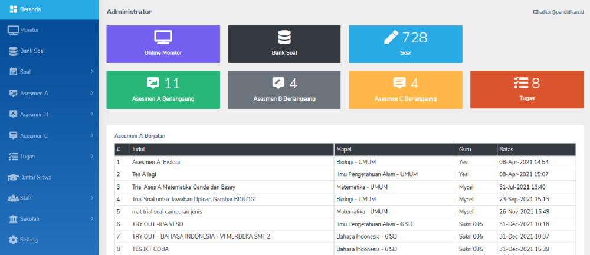
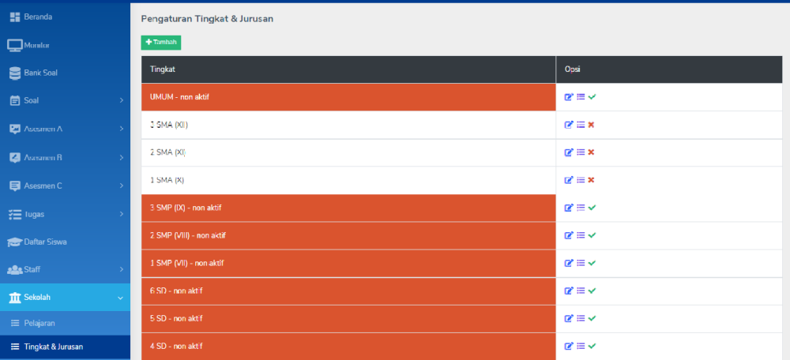
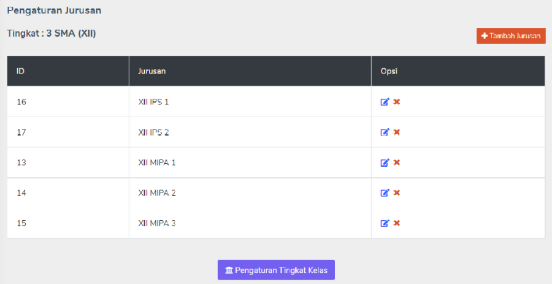
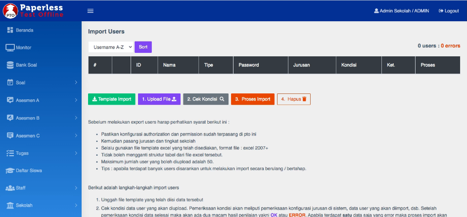

# Pengaturan dasar.

Semua pengaturan dasar ini dilakukan oleh **Admin**.

## Login Administrator

Administrator (_selanjutnya disebut_ **Admin**) dapat melakukan pengaturan tertentu pada PTO. Akun untuk Admin adalah akun khusus yang disediakan oleh sistem. Untk mengakses _Dashboard Admin_ cukup melakukan login pada halaman login seperti user-user lainnya.

1. Pastikan untuk logout semua akun.
2. Akses halaman PTO.
3. Login menggunakan akun Admin.

!!! Note 

    Default akun: 

    user: adminsekolah
    
    password: admin123

## Pengaturan kelas dan jurusan.

    
1. Klik menu **Sekolah.**
2. Pada submenu **Sekolah**, klik **Tingkat & Jurusan**.
3. Dalam daftar **Tingkat** (kelas).
    * **Tambah**: untuk menambah tingkat atau kelas baru.
    * **Edit**: untuk mengubah judul Tingkat
    * **Jurusan**: pengaturan jurusan
    * **Aktif-Non-aktif**: untuk mengaktifkan (warna putih) atau menon-aktifkan (warna oranye).
4. Ketika klik **Jurusan** pada masing **Tingkat** dapat ditambahkan **Jurusan** pada tingkat tersebut.

## Input data user.

1. Login menggunakan akun Admin.
2. Klik menu **Import users**.

    

3. Tersedia _template_ yang dapat digunakan untuk import user secara _bulk_. Silakan unduh template tersebut.
4. Dalam _template_ tersebut terdapat contoh data berupa kolom-kolom yang harus diisi dengan data user.
5. Buka hasil unduhan _template_. Hapus contoh data dan masukkan data sesuai kebutuhan yang terdiri dari:
    - **Nomor urut** (_maksimal jumlah data 300 user_)
    - **Username**
    - **Password**
    - **Nama**
    - **Email**
    - **Type** (_student / teacher_)
    - **Jurusan** (dapat dikosongi jika type user adalah guru) dan harus sesuai dengan jurusan yang telah dibuat di PTO.
6. Kembali ke menu **Import user**, klik **Upload File**. Pada dialog _Upload user_; 
    - Isikan jumlah user sesuai pada file template yang akan diunggah.
    - Pilih file template yang tersimpan dan sudah terisi dengan user-user baru.
    - Klik **Submit**.
7.  Semua daftar yang telah diinput di dalam file template akan muncul.
    - Klik Cek Kondisi  
    - Pastikan kolom Kondisi terisi OK semua.
8. Klik **Proses Import**.

!!! warning
    
    Jika kolom kondisi tidak OK, maka ada yang tidak beres pada isian template.

## Pengaturan mata pelajaran.

1. Klik menu **Sekolah**.
2. Pada submenu **Sekolah**, klik **Pelajaran**.
3. Klik **Tambah pelajaran** untuk menambahkan pelajaran baru.
4. Pada masing-masing pelajaran dapat diubah atau di-non-aktifkan.